## Overview

The `ProseMermaid` component renders diagrams using [Mermaid](https://mermaid.js.org/), a popular JavaScript-based diagramming and charting tool. It supports flowcharts, sequence diagrams, class diagrams, state diagrams, ER diagrams, and more.

::callout{variant="info" title="Features"}

- **Automatic Theme Detection** - Switches between light/dark themes
- **Lazy Loading** - Only renders when scrolled into view for better performance
- **Error Handling** - Shows friendly error messages if diagram syntax is invalid
- **Loading State** - Displays spinner while rendering

::

## Basic Usage

Use code blocks with the `mermaid` language:

::ShowCase{prose}

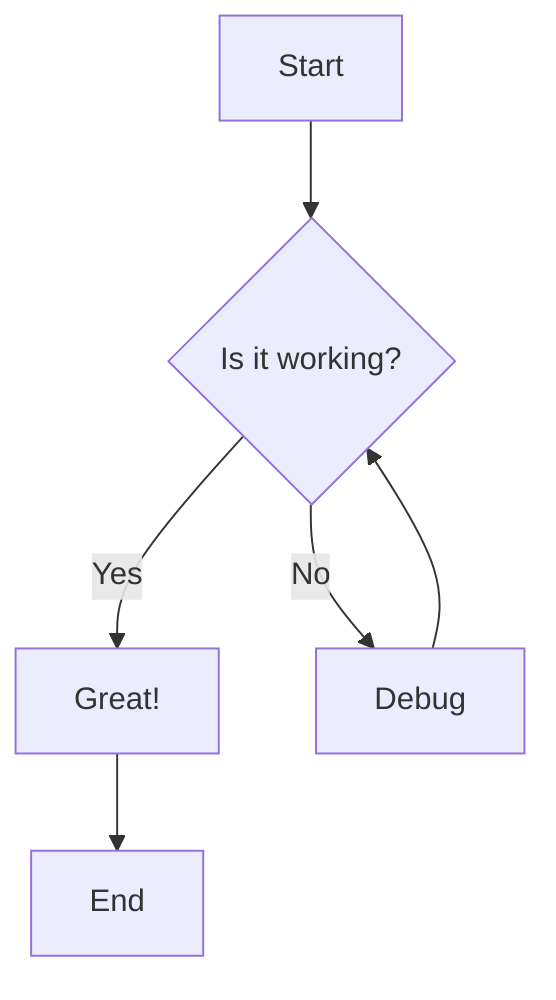
```mermaid
graph TD
    A[Start] --> B{Is it working?}
    B -->|Yes| C[Great!]
    B -->|No| D[Debug]
    D --> B
    C --> E[End]
```

#code

````mdc
```
graph TD
    A[Start] --> B{Is it working?}
    B -->|Yes| C[Great!]
    B -->|No| D[Debug]
    D --> B
    C --> E[End]
```
````

::

## Flowcharts

### Top to Bottom

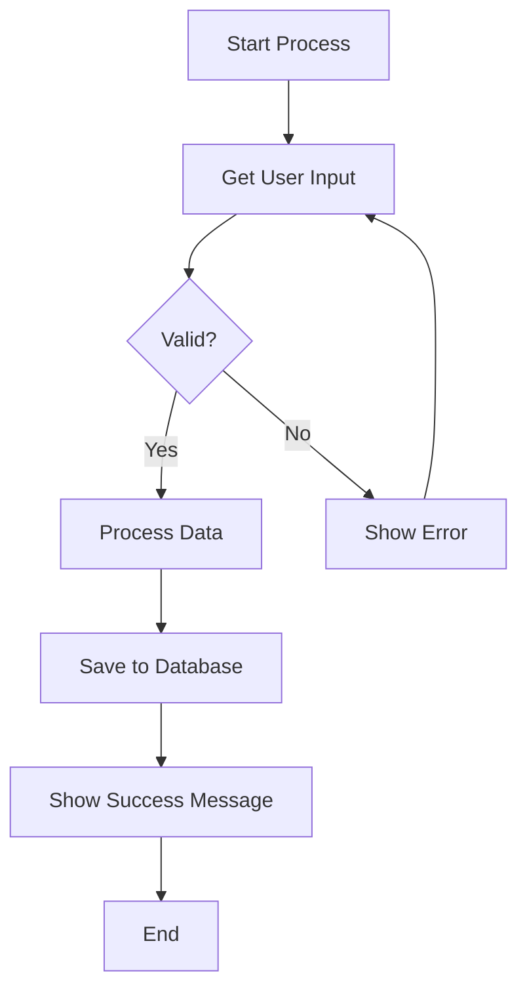
```mermaid
graph TD
    Start[Start Process] --> Input[Get User Input]
    Input --> Validate{Valid?}
    Validate -->|Yes| Process[Process Data]
    Validate -->|No| Error[Show Error]
    Error --> Input
    Process --> Save[Save to Database]
    Save --> Success[Show Success Message]
    Success --> End[End]
```

### Left to Right

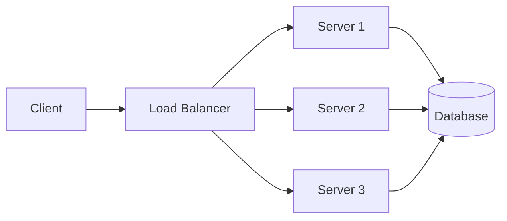
```mermaid
graph LR
    A[Client] --> B[Load Balancer]
    B --> C[Server 1]
    B --> D[Server 2]
    B --> E[Server 3]
    C --> F[(Database)]
    D --> F
    E --> F
```

### With Styling

::ShowCase{prose}

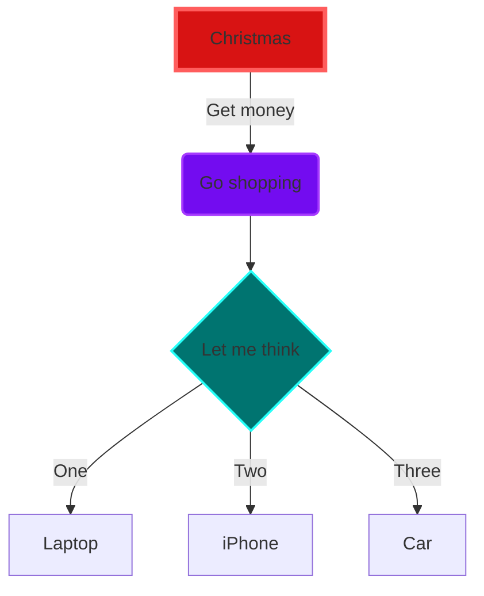
```mermaid
graph TD
    A[Christmas] -->|Get money| B(Go shopping)
    B --> C{Let me think}
    C -->|One| D[Laptop]
    C -->|Two| E[iPhone]
    C -->|Three| F[Car]

    style A fill:#D81313,stroke:#FF5D5D,stroke-width:4px
    style B fill:#730CF0,stroke:#A63AFE,stroke-width:2px
    style C fill:#007470,stroke:#25FFF8,stroke-width:2px
```

#code

````mdc

```mermaid
graph TD
    A[Christmas] -->|Get money| B(Go shopping)
    B --> C{Let me think}
    C -->|One| D[Laptop]
    C -->|Two| E[iPhone]
    C -->|Three| F[Car]

    style A fill:#D81313,stroke:#FF5D5D,stroke-width:4px
    style B fill:#730CF0,stroke:#A63AFE,stroke-width:2px
    style C fill:#007470,stroke:#25FFF8,stroke-width:2px
```
````

::

## Sequence Diagrams

### API Request Flow

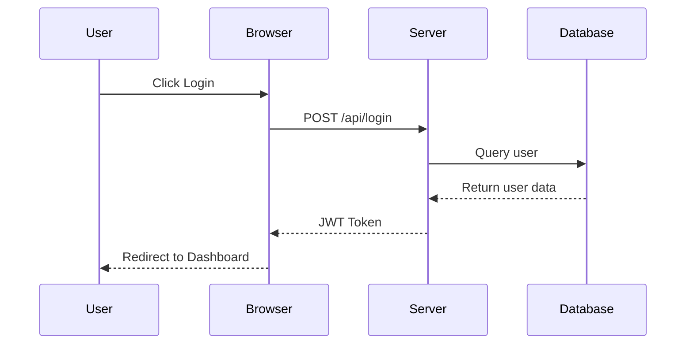
```mermaid
sequenceDiagram
    participant User
    participant Browser
    participant Server
    participant Database

    User->>Browser: Click Login
    Browser->>Server: POST /api/login
    Server->>Database: Query user
    Database-->>Server: Return user data
    Server-->>Browser: JWT Token
    Browser-->>User: Redirect to Dashboard
```

### Authentication Flow

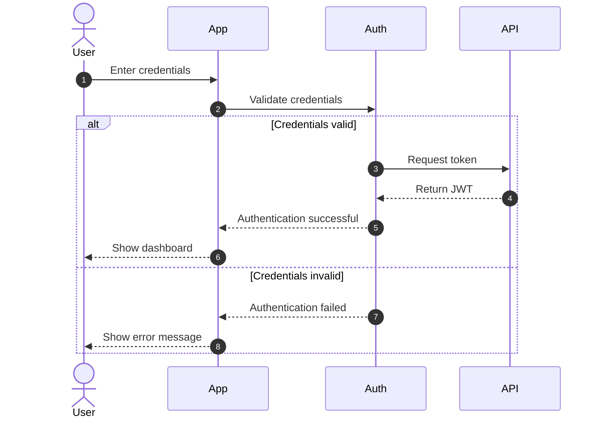
```mermaid
sequenceDiagram
    autonumber
    actor User
    participant App
    participant Auth
    participant API

    User->>App: Enter credentials
    App->>Auth: Validate credentials

    alt Credentials valid
        Auth->>API: Request token
        API-->>Auth: Return JWT
        Auth-->>App: Authentication successful
        App-->>User: Show dashboard
    else Credentials invalid
        Auth-->>App: Authentication failed
        App-->>User: Show error message
    end
```

### Loops and Notes

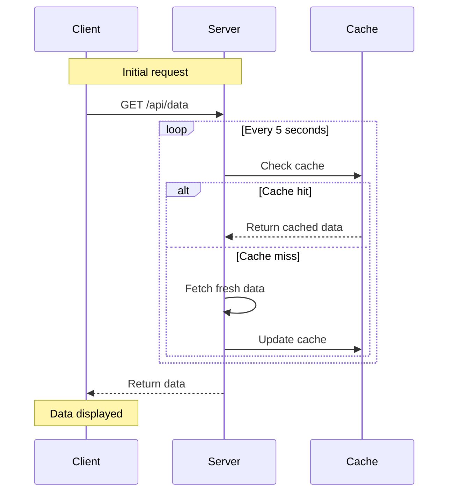
```mermaid
sequenceDiagram
    participant Client
    participant Server
    participant Cache

    Note over Client,Server: Initial request
    Client->>Server: GET /api/data

    loop Every 5 seconds
        Server->>Cache: Check cache
        alt Cache hit
            Cache-->>Server: Return cached data
        else Cache miss
            Server->>Server: Fetch fresh data
            Server->>Cache: Update cache
        end
    end

    Server-->>Client: Return data
    Note over Client: Data displayed
```

## Class Diagrams

### Simple Class Structure

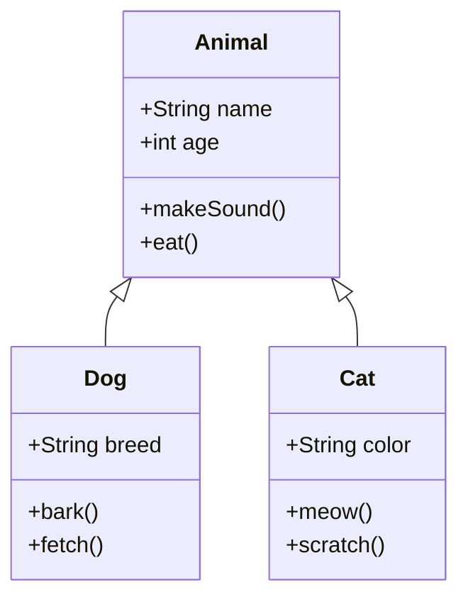
```mermaid
classDiagram
    class Animal {
        +String name
        +int age
        +makeSound()
        +eat()
    }

    class Dog {
        +String breed
        +bark()
        +fetch()
    }

    class Cat {
        +String color
        +meow()
        +scratch()
    }

    Animal <|-- Dog
    Animal <|-- Cat
```

### Full Example with Relationships

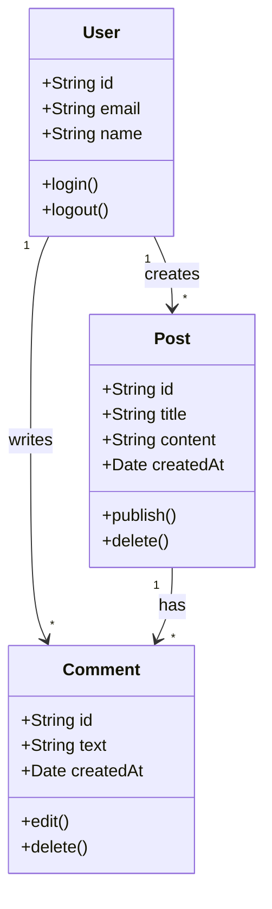
```mermaid
classDiagram
    class User {
        +String id
        +String email
        +String name
        +login()
        +logout()
    }

    class Post {
        +String id
        +String title
        +String content
        +Date createdAt
        +publish()
        +delete()
    }

    class Comment {
        +String id
        +String text
        +Date createdAt
        +edit()
        +delete()
    }

    User "1" --> "*" Post : creates
    User "1" --> "*" Comment : writes
    Post "1" --> "*" Comment : has
```

## State Diagrams

### Order Status

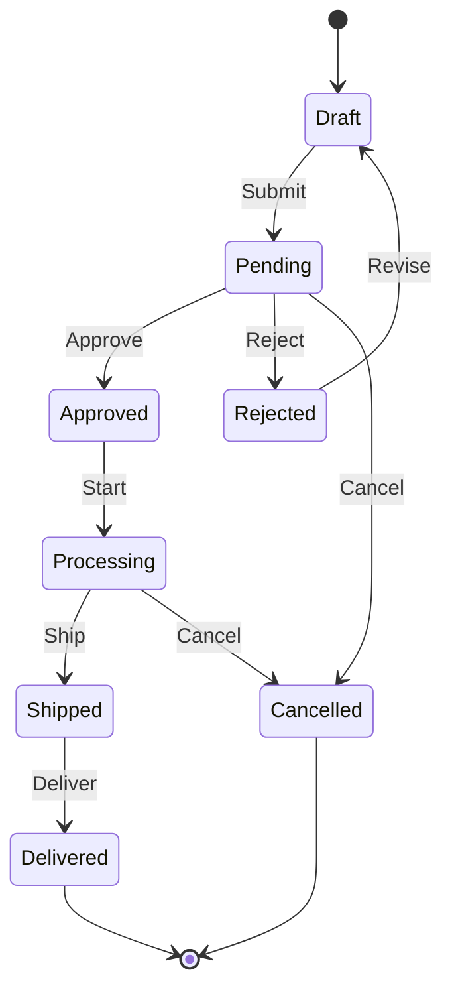
```mermaid
stateDiagram-v2
    [*] --> Draft
    Draft --> Pending : Submit
    Pending --> Approved : Approve
    Pending --> Rejected : Reject
    Rejected --> Draft : Revise
    Approved --> Processing : Start
    Processing --> Shipped : Ship
    Shipped --> Delivered : Deliver
    Delivered --> [*]

    Pending --> Cancelled : Cancel
    Processing --> Cancelled : Cancel
    Cancelled --> [*]
```

### Complex State Machine

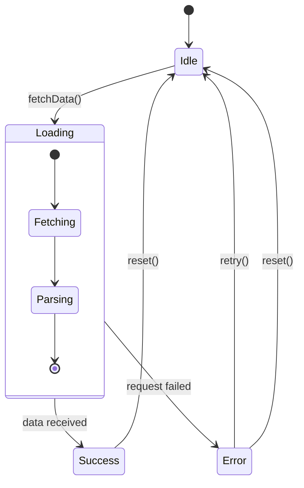
```mermaid
stateDiagram-v2
    [*] --> Idle

    Idle --> Loading : fetchData()
    Loading --> Success : data received
    Loading --> Error : request failed

    Success --> Idle : reset()
    Error --> Idle : retry()
    Error --> Idle : reset()

    state Loading {
        [*] --> Fetching
        Fetching --> Parsing
        Parsing --> [*]
    }
```

## Entity Relationship Diagrams

### Database Schema

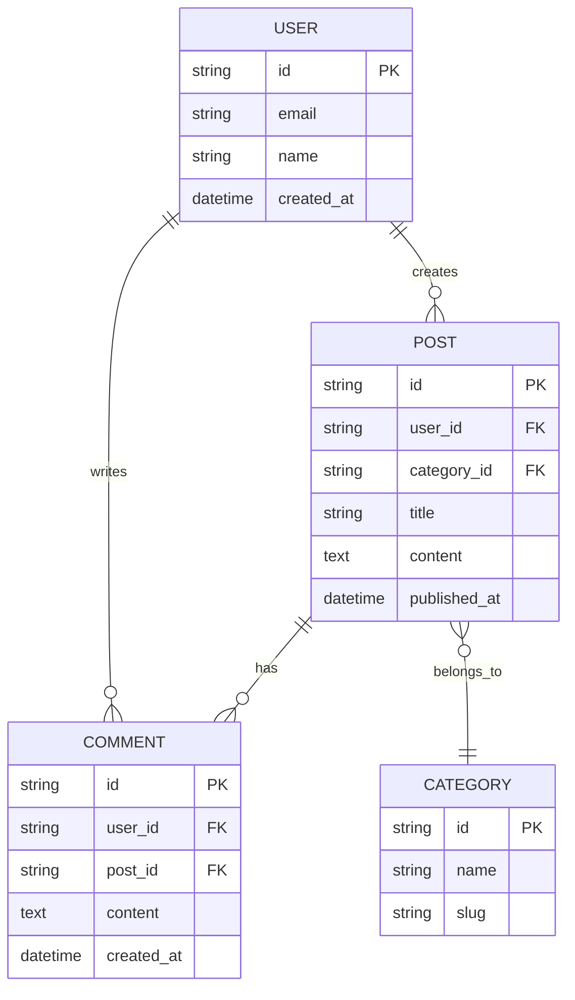
```mermaid
erDiagram
    USER ||--o{ POST : creates
    USER ||--o{ COMMENT : writes
    POST ||--o{ COMMENT : has
    POST }o--|| CATEGORY : belongs_to

    USER {
        string id PK
        string email
        string name
        datetime created_at
    }

    POST {
        string id PK
        string user_id FK
        string category_id FK
        string title
        text content
        datetime published_at
    }

    COMMENT {
        string id PK
        string user_id FK
        string post_id FK
        text content
        datetime created_at
    }

    CATEGORY {
        string id PK
        string name
        string slug
    }
```

## Pie Charts

### Simple Distribution

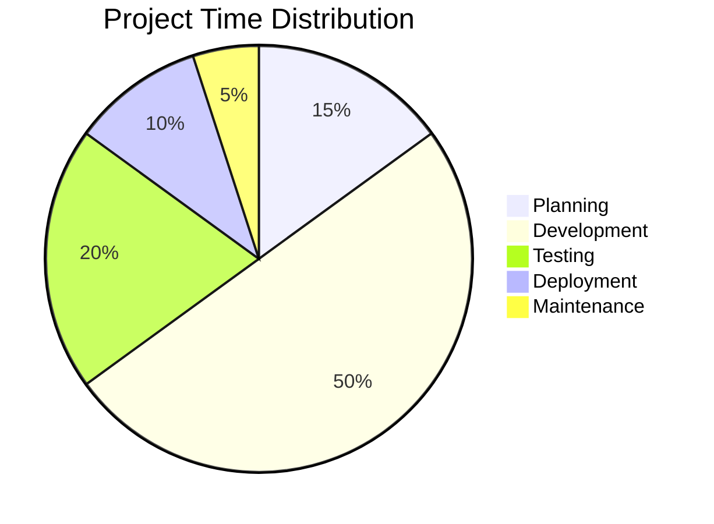
```mermaid
pie title Project Time Distribution
    "Planning" : 15
    "Development" : 50
    "Testing" : 20
    "Deployment" : 10
    "Maintenance" : 5
```

### Technology Stack Usage

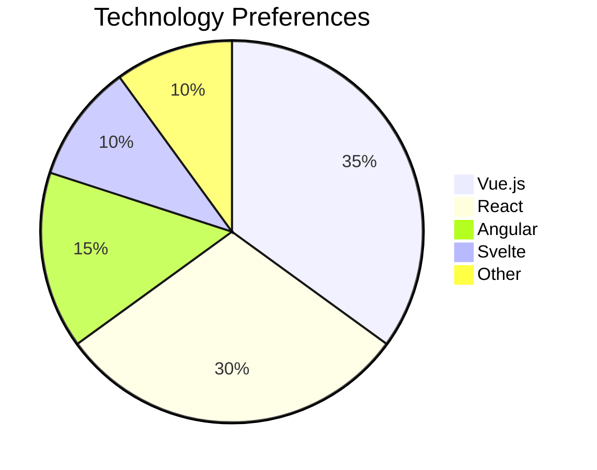
```mermaid
pie title Technology Preferences
    "Vue.js" : 35
    "React" : 30
    "Angular" : 15
    "Svelte" : 10
    "Other" : 10
```

## Gantt Charts

### Project Timeline

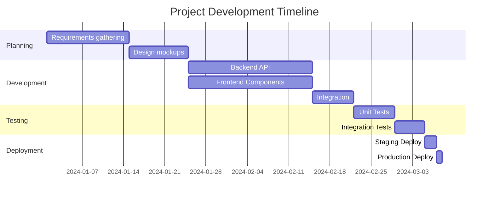
```mermaid
gantt
    title Project Development Timeline
    dateFormat YYYY-MM-DD
    section Planning
        Requirements gathering     :a1, 2024-01-01, 14d
        Design mockups            :a2, after a1, 10d
    section Development
        Backend API               :b1, after a2, 21d
        Frontend Components       :b2, after a2, 21d
        Integration              :b3, after b1, 7d
    section Testing
        Unit Tests               :c1, after b3, 7d
        Integration Tests        :c2, after c1, 5d
    section Deployment
        Staging Deploy           :d1, after c2, 2d
        Production Deploy        :d2, after d1, 1d
```

## Git Graph

### Branch Strategy

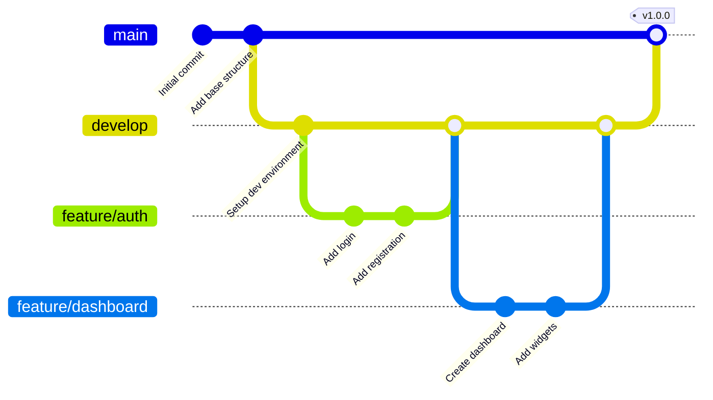
```mermaid
gitGraph
    commit id: "Initial commit"
    commit id: "Add base structure"
    branch develop
    checkout develop
    commit id: "Setup dev environment"
    branch feature/auth
    checkout feature/auth
    commit id: "Add login"
    commit id: "Add registration"
    checkout develop
    merge feature/auth
    branch feature/dashboard
    checkout feature/dashboard
    commit id: "Create dashboard"
    commit id: "Add widgets"
    checkout develop
    merge feature/dashboard
    checkout main
    merge develop tag: "v1.0.0"
```

## Journey Diagrams

### User Experience

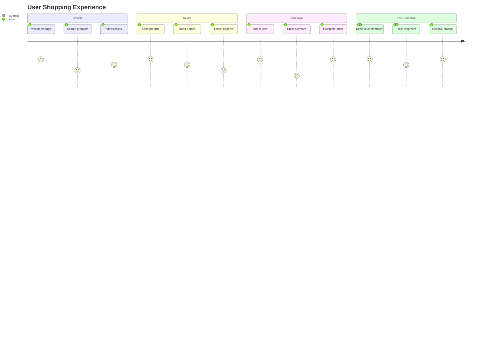
```mermaid
journey
    title User Shopping Experience
    section Browse
        Visit homepage: 5: User
        Search products: 3: User
        View results: 4: User
    section Select
        Click product: 5: User
        Read details: 4: User
        Check reviews: 3: User
    section Purchase
        Add to cart: 5: User
        Enter payment: 2: User
        Complete order: 5: User
    section Post-Purchase
        Receive confirmation: 5: User, System
        Track shipment: 4: User, System
        Receive product: 5: User
```

## Quadrant Chart

### Feature Prioritization

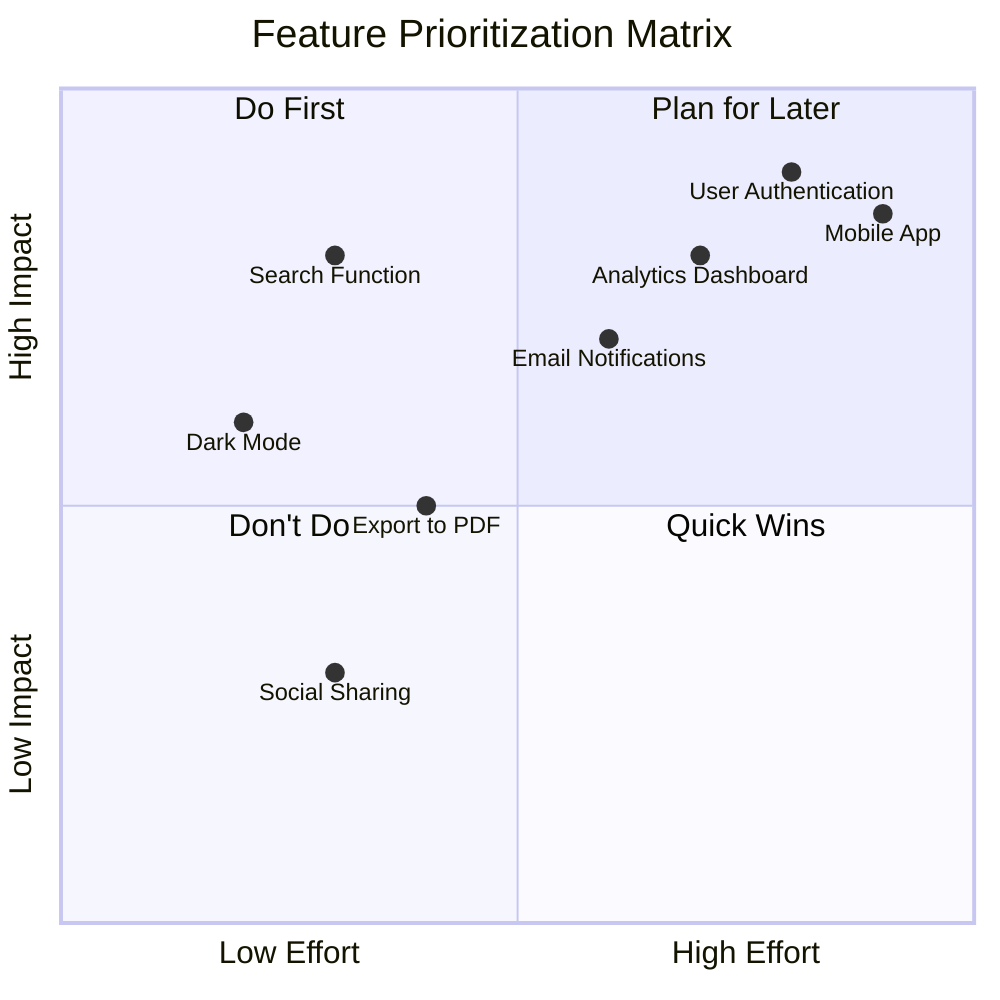
```mermaid
quadrantChart
    title Feature Prioritization Matrix
    x-axis Low Effort --> High Effort
    y-axis Low Impact --> High Impact
    quadrant-1 Plan for Later
    quadrant-2 Do First
    quadrant-3 Don't Do
    quadrant-4 Quick Wins

    User Authentication: [0.8, 0.9]
    Dark Mode: [0.2, 0.6]
    Email Notifications: [0.6, 0.7]
    Analytics Dashboard: [0.7, 0.8]
    Social Sharing: [0.3, 0.3]
    Export to PDF: [0.4, 0.5]
    Mobile App: [0.9, 0.85]
    Search Function: [0.3, 0.8]
```

## Error Handling

If there's an error in your diagram syntax, you'll see a helpful error message:

```mermaid
graph TD
    This is invalid syntax
    It will show an error
```

## Code Fence Meta Options

You can add options to the code fence:

````mdc
```mermaid
graph TD
    A --> B
```
````

## Common Use Cases

### Documentation

Use flowcharts to explain processes:

```mermaid
graph TD
    A[User visits site] --> B{Authenticated?}
    B -->|Yes| C[Show Dashboard]
    B -->|No| D[Show Login]
    D --> E[User logs in]
    E --> C
    C --> F[User interacts]
```

### Architecture Diagrams

Show system components:

```mermaid
graph TB
    subgraph Frontend
        A[React App]
        B[Vue App]
    end

    subgraph Backend
        C[API Gateway]
        D[Auth Service]
        E[Data Service]
    end

    subgraph Database
        F[(PostgreSQL)]
        G[(Redis Cache)]
    end

    A --> C
    B --> C
    C --> D
    C --> E
    D --> F
    E --> F
    E --> G
```

### Process Flows

Document workflows:

```mermaid
graph LR
    A[Pull Request] --> B{CI Passed?}
    B -->|No| C[Fix Issues]
    C --> A
    B -->|Yes| D{Review Approved?}
    D -->|No| E[Address Feedback]
    E --> A
    D -->|Yes| F[Merge to Main]
    F --> G[Deploy to Staging]
    G --> H{Tests Pass?}
    H -->|No| I[Rollback]
    H -->|Yes| J[Deploy to Production]
```

## Performance

The component uses:

- **Intersection Observer** - Only renders when scrolled into view
- **Lazy Loading** - Improves initial page load time
- **Smart Re-rendering** - Only re-renders on theme or code changes

## Theme Switching

The component automatically detects your color mode and applies the appropriate Mermaid theme:

- **Light Mode** - Uses default Mermaid theme
- **Dark Mode** - Uses dark Mermaid theme

When you switch themes, diagrams automatically re-render with the new theme.

## Configuration

The Mermaid instance is configured in `app/plugins/mermaid.client.ts`:

::prose-code-snippet{file="/plugins/mermaid.client.ts" language="ts" title="Mermaid Plugin Configuration"}
::

You can customize these settings based on your needs.

## Best Practices

::callout{variant="tip" title="Tips for Mermaid Diagrams"}

- Keep diagrams simple and focused on one concept
- Use descriptive labels for better understanding
- Add notes to explain complex parts
- Use subgraphs to group related nodes
- Choose appropriate diagram types for your content
- Test your diagrams for syntax errors before publishing
- Use styling sparingly to highlight important elements

::

## Resources

::prose-icon-list

::prose-li{icon="lucide:book"}
[Official Mermaid Documentation](https://mermaid.js.org/){target="\_blank"}
::
::prose-li{icon="lucide:pen"}
[Live Editor](https://mermaid.live/){target="\_blank"}
::
::prose-li{icon="lucide:file-text"}
[Mermaid Cheat Sheet](https://jojozhuang.github.io/tutorial/mermaid-cheat-sheet/){ target="\_blank"}
::
::prose-li{icon="lucide:github"}
[GitHub Integration](https://github.blog/2022-02-14-include-diagrams-markdown-files-mermaid/){target="\_blank"}
::

::

## Troubleshooting

::prose-collapsible{open-title="Show common issues" close-title="Hide common issues"}

**Diagram not rendering**

- Check your syntax using the [Live Editor](https://mermaid.live/)
- Ensure you're using the correct diagram type keyword
- Look for error messages in the browser console

**Theme not switching**

- The component watches color mode changes automatically
- Ensure `useColorMode()` is properly configured in your Nuxt app

**Performance issues with many diagrams**

- The component already uses lazy loading via IntersectionObserver
- Consider splitting content into multiple pages

::

## Advanced Examples

### Complex Sequence Diagram

```mermaid
sequenceDiagram
    autonumber
    participant U as User
    participant A as App
    participant API as API Server
    participant DB as Database
    participant Cache as Redis
    participant Queue as Job Queue

    U->>A: Submit form
    A->>API: POST /api/submit

    Note over API: Validate request

    API->>Cache: Check rate limit
    Cache-->>API: OK

    API->>DB: Begin transaction
    API->>DB: Insert record
    DB-->>API: Record created

    API->>Queue: Enqueue job
    Queue-->>API: Job queued

    API->>DB: Commit transaction
    DB-->>API: Committed

    API-->>A: 201 Created
    A-->>U: Show success

    Note over Queue,DB: Background processing
    Queue->>DB: Process job
    DB-->>Queue: Done
```

### Multi-Level State Diagram

```mermaid
stateDiagram-v2
    [*] --> Application

    state Application {
        [*] --> Init
        Init --> Ready

        state Ready {
            [*] --> Idle
            Idle --> Active : user action
            Active --> Processing : submit
            Processing --> Idle : complete

            state Processing {
                [*] --> Validating
                Validating --> Submitting
                Submitting --> [*]
            }
        }

        Ready --> Error : exception
        Error --> Ready : retry
    }

    Application --> [*] : shutdown
```
